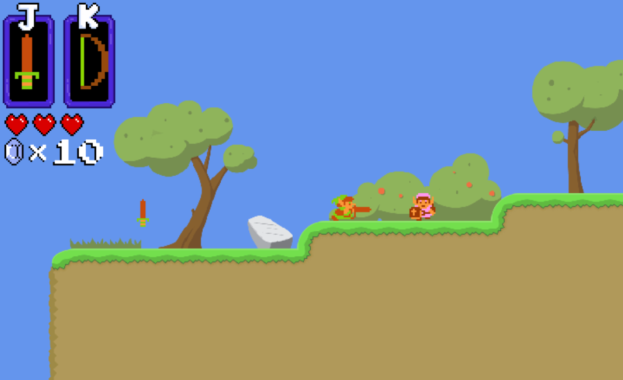

# Zeldorks

This project is a multiplayer game based on the original Zelda game from the 1980s.

Explore the dungeon, kill enemies and other players, and collect keys to
unlock the path to the Triforce Shard!

## Features

- Networked multiplayer support
- Cross-platform support (Windows, Mac, Linux)
  - Target framework: .NET Core 2.0
- Support maps created from the [Tiled](https://www.mapeditor.org/) map editor
- Adventure and deathmatch game modes

Development branch: `features`

## Building

The solution can be built using Visual Studio or `dotnet build`.

## Usage

To start a game, a server and one or more clients are required. The code and
executables for client and server can be found in their respective projects.

## Client controls

- To connect to the server, press `C`
- To disconnect from the server, press `V`
- To exit the game, press `Escape`.
- To move the player, use the `WASD` keys

- To use the item in slot A, press `J`
- To use the item in slot B, press `K`
- To switch to the next item in slot A, press `L`
- To switch to the next item in slot B, press `;`
- To switch to the previous item in slot A, press `O`
- To switch to the previous item in slot B, press `P`

- To print debug information to the console, press `Q`
- To render debug information to the screen, press and hold `R`
- To simulate losing the connection, press and hold `E`

## Assets
Credit for all assets go to their respective creators.
